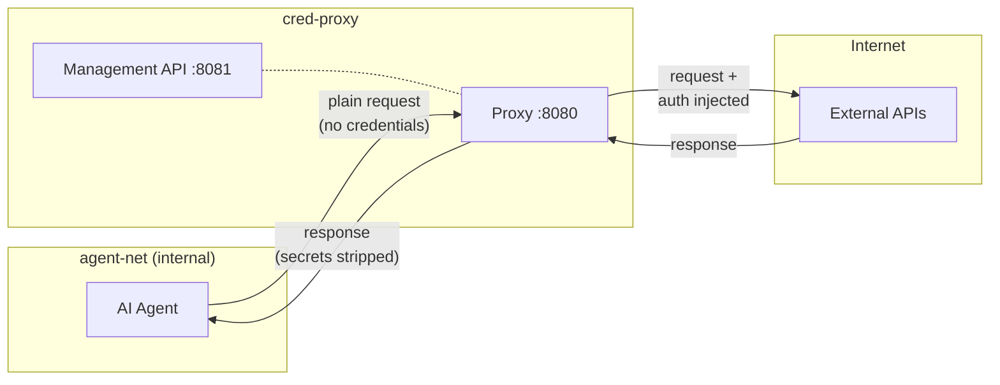

# cred-proxy

[](https://github.com/your-org/cred-proxy/actions/workflows/ci.yml)
[](LICENSE)
[](https://www.python.org/downloads/)

**Transparent authentication injection proxy for AI agents.**

cred-proxy is a [mitmproxy](https://mitmproxy.org/)-based proxy that sits between your AI agent and external APIs. It automatically injects authentication credentials into outbound HTTP requests so agents never handle secrets directly. Supports bearer tokens, basic auth, custom headers, query parameters, OAuth2 client credentials, and external credential scripts. Access rules provide URL-level allowlist/denylist filtering per domain.



## Quick Start

**1. Configure credentials:**

```bash
cp config.example.yaml credentials.yaml
# Edit credentials.yaml with your API keys
```

**2. Start the proxy:**

```bash
docker compose up -d
```

**3. Point your agent at the proxy:**

```yaml
# In your agent's environment:
HTTP_PROXY: http://auth-proxy:8080
HTTPS_PROXY: http://auth-proxy:8080
```

**4. Verify:**

```bash
curl http://localhost:8081/api/status
# {"status": "ok", "uptime_seconds": 5.2, "total_rules": 1, "enabled_rules": 1}
```

Requests from the agent to matching domains are automatically authenticated.

## Agent Credential Requests

Agents can request credentials at runtime for services they don't yet have access to:

```bash
# Agent requests access to a new service
curl -x http://auth-proxy:8080 \
  -X POST http://any-host/__auth/request \
  -H "Content-Type: application/json" \
  -d '{"domain": "api.newservice.com", "auth_type": "bearer"}'

# Returns a setup URL for a human to provide credentials
# {"setup_url": "http://localhost:8081/setup/abc123...", "token": "abc123..."}
```

The agent polls for status; once a user fills in the form, the credential is live and requests are authenticated automatically.

## Documentation

| Page | Description |
|------|-------------|
| [Getting Started](docs/getting-started.md) | Install, configure, and run |
| [Configuration](docs/configuration.md) | YAML reference, all 6 auth types, domain matching |
| [Architecture](docs/architecture.md) | Component design, request lifecycle, security model |
| [Management API](docs/api/management.md) | REST API for credential CRUD and status |
| [Agent API](docs/api/agent.md) | In-band `/__auth/*` endpoints for agents |
| [Deployment](docs/deployment.md) | Docker, networking, CA trust, production notes |
| [Development](docs/development.md) | Testing, linting, adding auth types, contributing |

## Development

```bash
# Install dependencies
just install

# Run tests (217 tests)
just test

# Lint + type check
just lint && just typecheck

# Serve docs locally
just docs
```

## License

[MIT](LICENSE)
