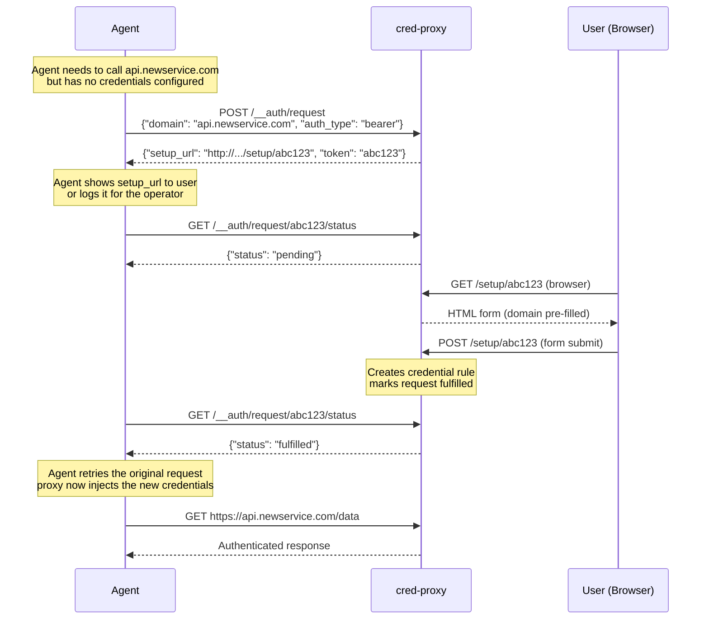

# Agent API

The agent API provides in-band endpoints at `/__auth/*` that agents can call through the proxy to discover available credentials and request new ones. These endpoints are intercepted by the proxy and handled internally — they never reach an upstream server.

## Endpoints

### `GET /__auth/credentials`

List available credentials (without secret values).

**Query parameters:**

| Parameter | Type | Description |
|-----------|------|-------------|
| `domain` | string | Filter credentials by domain (substring match, case-insensitive) |

**Response:** `200 OK`

```json
[
  {
    "id": "openai-prod",
    "domain": "api.openai.com",
    "enabled": true
  },
  {
    "id": "github-api",
    "domain": "api.github.com",
    "enabled": true
  }
]
```

**Example:**

```bash
# List all credentials
curl -x http://auth-proxy:8080 http://any-host/__auth/credentials

# Filter by domain
curl -x http://auth-proxy:8080 "http://any-host/__auth/credentials?domain=openai"
```

!!! note
    The hostname in the URL doesn't matter — the proxy intercepts any request with the `/__auth/` path prefix regardless of the target host.

### `POST /__auth/request`

Request credentials for a domain the agent needs to access. This creates a pending request that a user can fulfill through the management UI setup flow.

**Request body:**

```json
{
  "domain": "api.newservice.com",
  "auth_type": "bearer",
  "reason": "Need to call the NewService API for data retrieval"
}
```

| Field | Type | Required | Description |
|-------|------|----------|-------------|
| `domain` | string | yes | Domain the agent needs credentials for |
| `auth_type` | string | no | Preferred auth type (`bearer`, `basic`, `header`, `query_param`, `oauth2_client_credentials`) |
| `reason` | string | no | Human-readable reason for the request (max 500 chars) |
| `webhook_url` | string | no | HTTP/HTTPS URL to receive a POST notification when the request is fulfilled or expires |

**Response:** `200 OK`

```json
{
  "setup_url": "http://localhost:8081/setup/abc123...",
  "token": "abc123...",
  "expires_in": 900
}
```

| Field | Description |
|-------|-------------|
| `setup_url` | URL for a user to open in a browser to provide credentials |
| `token` | Token to poll for request status |
| `expires_in` | Seconds until the request expires (default: 900 / 15 minutes) |

**Errors:**

| Status | Reason |
|--------|--------|
| `400` | Invalid JSON, invalid domain, invalid auth_type, reason too long, or invalid webhook_url |
| `429` | Rate limit exceeded (10 requests per 60 seconds) |

**Example:**

```bash
curl -x http://auth-proxy:8080 \
  -X POST http://any-host/__auth/request \
  -H "Content-Type: application/json" \
  -d '{
    "domain": "api.newservice.com",
    "auth_type": "bearer",
    "reason": "Need API access for data retrieval"
  }'
```

**Example with webhook:**

```bash
curl -x http://auth-proxy:8080 \
  -X POST http://any-host/__auth/request \
  -H "Content-Type: application/json" \
  -d '{
    "domain": "api.newservice.com",
    "auth_type": "bearer",
    "reason": "Need API access",
    "webhook_url": "https://hooks.example.com/whk_abc123"
  }'
```

#### Webhook Notifications

When `webhook_url` is provided, cred-proxy sends a POST notification when the request status changes:

**Payload (on fulfillment):**

```json
{
  "token": "abc123...",
  "status": "fulfilled",
  "domain": "api.newservice.com"
}
```

**Payload (on expiry):**

```json
{
  "token": "abc123...",
  "status": "expired",
  "domain": "api.newservice.com"
}
```

- **Fire-and-forget**: 5-second timeout, single attempt, no retries
- **Non-blocking**: Webhook failure does not affect credential activation
- Polling via `GET /__auth/request/{token}/status` still works alongside webhooks

### `GET /__auth/request/{token}/status`

Poll the status of a pending credential request.

**Response:** `200 OK`

```json
{
  "status": "pending"
}
```

Possible status values:

| Status | Meaning |
|--------|---------|
| `pending` | Waiting for user to provide credentials |
| `fulfilled` | User has provided credentials, rule is active |
| `expired` | Request TTL has elapsed |

**Errors:**

| Status | Reason |
|--------|--------|
| `404` | Unknown request token |

**Example:**

```bash
curl -x http://auth-proxy:8080 http://any-host/__auth/request/abc123.../status
```

## Credential Request Flow

The full credential request flow involves the agent, the proxy, and a human user:



### Typical Agent Implementation

```python
import requests
import time

PROXY = "http://auth-proxy:8080"
proxies = {"http": PROXY, "https": PROXY}

# 1. Try the request — if it fails with 401/403, request credentials
resp = requests.get("https://api.newservice.com/data", proxies=proxies)
if resp.status_code in (401, 403):

    # 2. Request credentials
    req = requests.post(
        "http://any-host/__auth/request",
        json={"domain": "api.newservice.com", "auth_type": "bearer"},
        proxies=proxies,
    )
    data = req.json()
    print(f"Please provide credentials at: {data['setup_url']}")

    # 3. Poll until fulfilled or expired
    while True:
        status = requests.get(
            f"http://any-host/__auth/request/{data['token']}/status",
            proxies=proxies,
        ).json()

        if status["status"] == "fulfilled":
            break
        elif status["status"] == "expired":
            raise RuntimeError("Credential request expired")

        time.sleep(5)

    # 4. Retry — proxy now injects credentials automatically
    resp = requests.get("https://api.newservice.com/data", proxies=proxies)
```

## Rate Limiting

Credential requests (`POST /__auth/request`) are rate-limited to **10 requests per 60-second sliding window**. This prevents agents from flooding the system with credential requests. Exceeding the limit returns `429 Too Many Requests`.

## Security Notes

- Agent API responses never include secret values — only credential IDs, domains, and enabled status
- Setup tokens are cryptographically random (32-byte `secrets.token_urlsafe`)
- Tokens are single-use — once a setup form is submitted, the token cannot be reused
- Tokens expire after the configured TTL (default: 15 minutes)
- Domain validation uses a strict regex to prevent injection attacks
