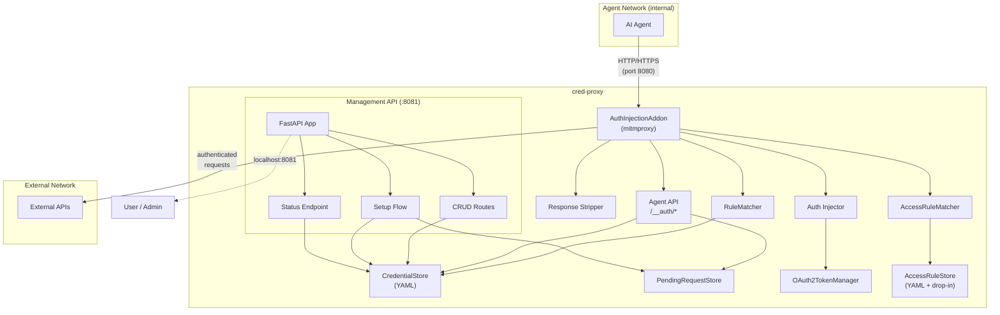
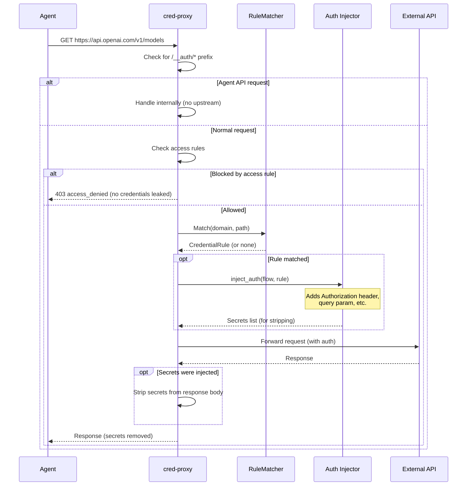
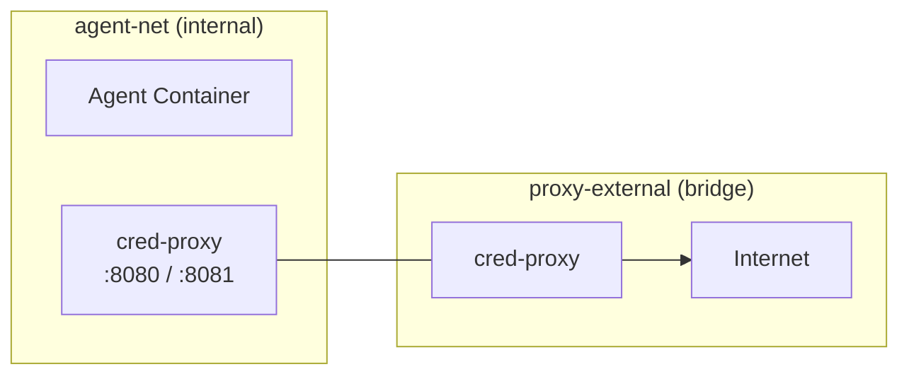

# Architecture

cred-proxy is a mitmproxy addon with three communication surfaces: proxy traffic interception, an agent-facing API, and a management API.

## Component Overview

## Request Lifecycle

When the agent makes an HTTP request through the proxy:

## Network Topology

Docker Compose creates two networks for isolation:

| Network | Type | Purpose |
|---------|------|---------|
| `agent-net` | internal | Agent-to-proxy communication only. No internet access. |
| `proxy-external` | bridge | Proxy-to-internet. Only the proxy container is connected. |

This ensures agents cannot bypass the proxy to reach external services directly.

## Security Model

- **Agents never see credentials** — secrets are injected at the proxy layer
- **Response stripping** — if an API echoes back a secret (e.g., in error messages), the proxy replaces it with `[REDACTED]` before returning to the agent
- **Management API masking** — the `/api/credentials` endpoint masks secret values (e.g., `sk-***789`) so even management clients don't see full secrets
- **Network isolation** — the agent network has no direct internet access
- **Single-use setup tokens** — credential request tokens are single-use, TTL-bounded, and rate-limited
- **Access rules** — blocked requests are rejected before credential injection, preventing secret leakage to unauthorized paths
- **CA certificates** — HTTPS interception uses mitmproxy's generated CA, shared via Docker volume

## Module Map

| Module | Purpose |
|--------|---------|
| `addon.py` | mitmproxy addon entry point, wires all components |
| `config.py` | YAML config loading and validation |
| `matching/models.py` | Pydantic models for credential rules and auth types |
| `matching/rules.py` | Domain/path matching logic |
| `injection/injector.py` | Dispatches to auth-type-specific injectors |
| `injection/bearer.py` | Bearer token injection |
| `injection/basic.py` | Basic auth injection |
| `injection/header.py` | Custom header injection |
| `injection/query_param.py` | Query parameter injection |
| `injection/oauth2.py` | OAuth2 client credentials flow + token caching |
| `stripping/response_strip.py` | Removes injected secrets from response bodies |
| `access/models.py` | Pydantic model for access rules (allowlist/denylist) |
| `access/matcher.py` | Domain/path matching for access rules |
| `access/store.py` | YAML-backed access rule store with group support and hot-reload |
| `store/interface.py` | Abstract `CredentialStore` interface |
| `store/yaml_store.py` | YAML-backed credential store with atomic writes and hot-reload |
| `store/masking.py` | Secret value masking for API responses |
| `agent_api/handlers.py` | `/__auth/*` request handlers (in mitmproxy) |
| `requests/pending.py` | In-memory pending request store with TTL and rate limiting |
| `mgmt/app.py` | FastAPI application factory |
| `mgmt/routes_credentials.py` | CRUD routes for `/api/credentials` |
| `mgmt/routes_setup.py` | Setup flow routes (`/setup/{token}`) |
| `mgmt/routes_access_rules.py` | CRUD routes for `/api/access-rules` |
| `mgmt/routes_status.py` | Status endpoint (`/api/status`) |
| `logging.py` | Logging configuration with secret masking filter |

## Credential Store

The `CredentialStore` is an abstract interface with a single implementation (`YamlCredentialStore`):

- **Atomic writes** — uses `os.replace()` to atomically swap the credentials file
- **Hot-reload** — uses [watchfiles](https://watchfiles.helpmanual.io/) to detect file changes and reload rules
- **Thread-safe** — all operations are protected by a lock

The abstraction exists to support future backends (database, vault, etc.) without changing the rest of the codebase.

## OAuth2 Token Lifecycle

For `oauth2_client_credentials` rules, the `OAuth2TokenManager` handles the token lifecycle:

1. **First request** — no cached token, performs client credentials grant against `token_url`
2. **Subsequent requests** — uses cached token if not expired
3. **Expiry** — tokens are refreshed 30 seconds before their `expires_in` time
4. **Errors** — token fetch failures are logged, request proceeds without auth
