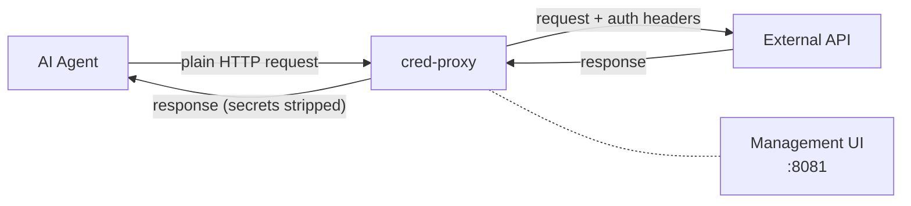

# cred-proxy

**Transparent authentication injection proxy for AI agents.**

cred-proxy is a [mitmproxy](https://mitmproxy.org/)-based proxy that sits between your AI agent and external APIs. It automatically injects authentication credentials into outbound HTTP requests so agents never need to handle secrets directly.

## Why?

AI agents need to call authenticated APIs, but giving agents raw credentials creates security and management challenges. cred-proxy solves this by:

- **Keeping secrets out of agent context** — agents never see tokens, passwords, or API keys
- **Centralizing credential management** — configure once, apply to all agent traffic
- **Supporting dynamic credential requests** — agents can request access to new services at runtime
- **Stripping leaked secrets from responses** — prevents accidental credential exposure in API responses

## How It Works

The proxy intercepts outbound requests from the agent container, matches them against configured credential rules by domain and path, and injects the appropriate authentication (bearer tokens, basic auth, custom headers, query parameters, or OAuth2 client credentials). Responses are scanned to strip any injected secrets before returning to the agent.

## Features

- **6 authentication types** — Bearer, Basic, Header, Query Parameter, OAuth2 Client Credentials, External Script
- **Access rules** — allowlist/denylist URL filtering per domain with regex path patterns
- **Domain + path matching** — exact domains, wildcard subdomains (`*.example.com`), path prefix filtering
- **Management API** — REST API for CRUD operations on credentials and access rules
- **Agent API** — in-band `/__auth/*` endpoints for agents to discover and request credentials
- **Setup flow** — browser-based form for users to fill in credentials when agents request them
- **Hot-reload** — credential and access rule changes are picked up automatically via filesystem watching
- **Response stripping** — injected secrets are removed from response bodies
- **Secret masking** — API responses never expose full secret values
- **Docker-first** — network isolation with separate internal (agent) and external (proxy) networks

## Next Steps

- [Getting Started](getting-started.md) — install and run in 5 minutes
- [Configuration](configuration.md) — credential rules, auth types, YAML reference
- [Architecture](architecture.md) — component design and request lifecycle
- [API Reference](api/management.md) — management and agent API endpoints
- [Deployment](deployment.md) — Docker, networking, and production setup
- [Development](development.md) — contributing, testing, project structure
